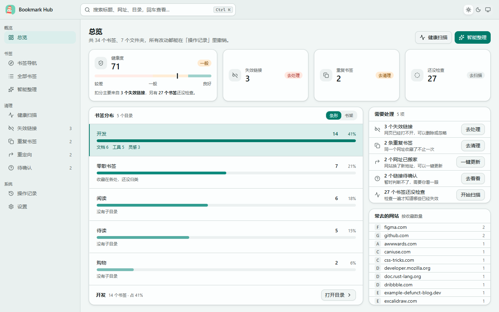
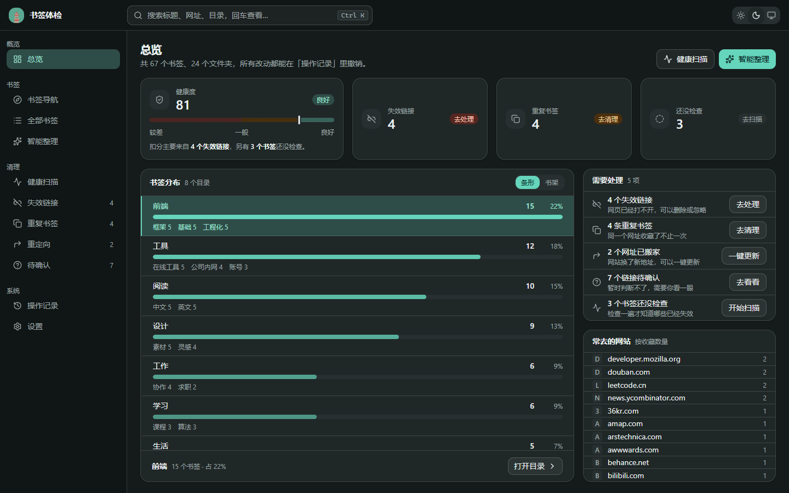
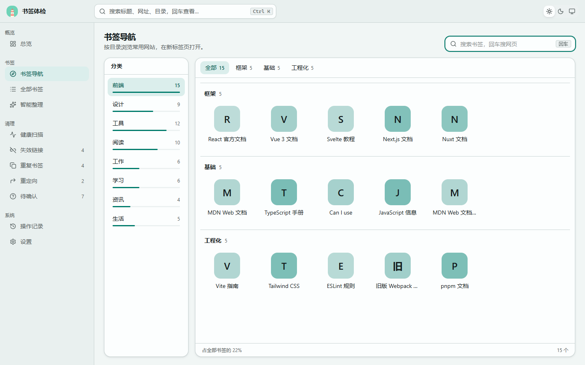
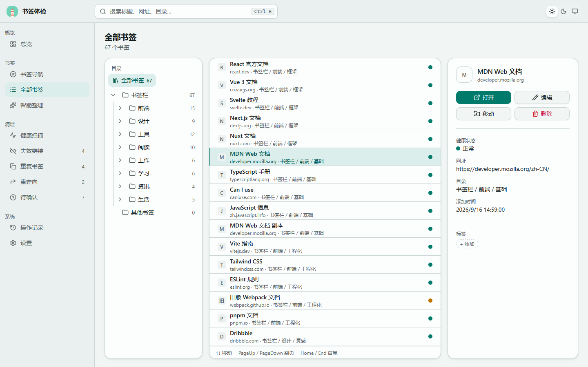
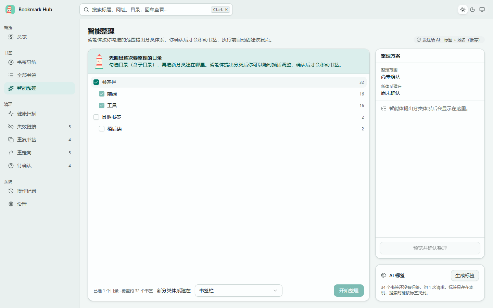
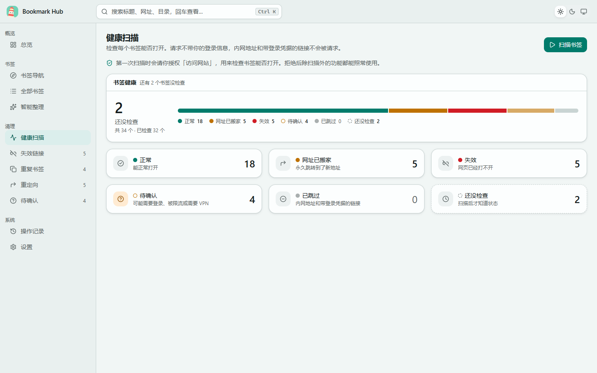
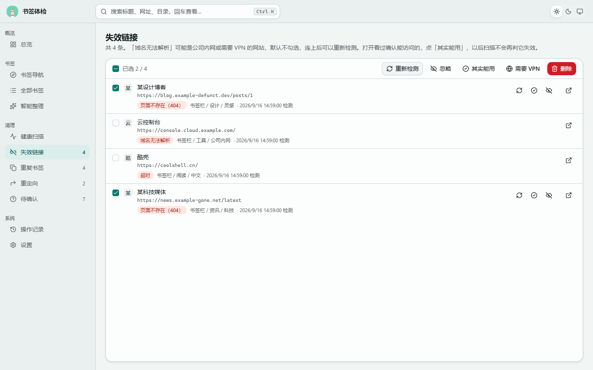
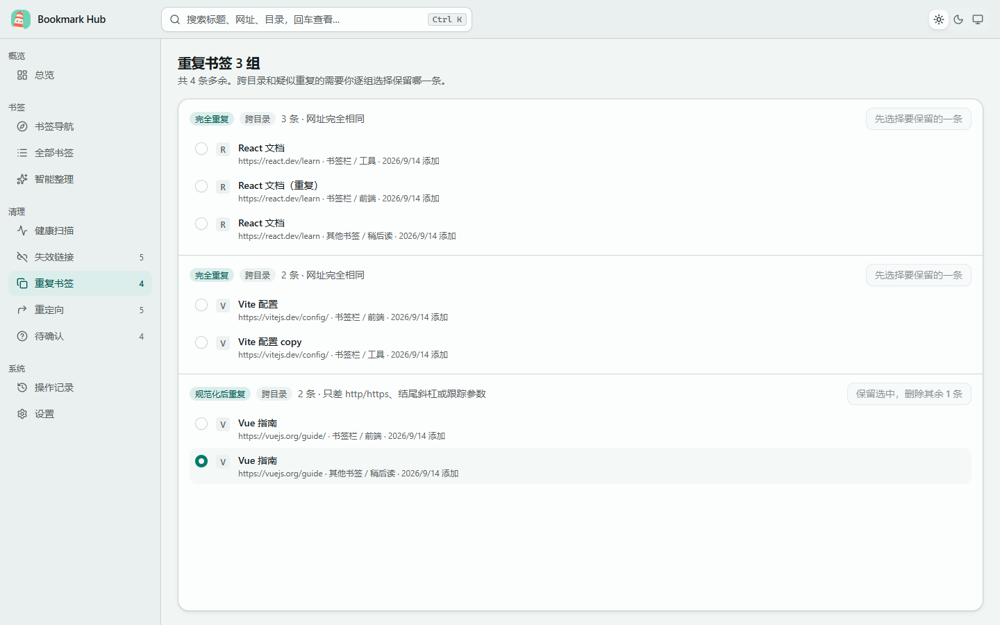

<p align="center">
  
</p>

<h2 align="center">书签体检：检测、清理、整理你的浏览器书签</h2>

<p align="center">
  
  <a href="https://microsoftedge.microsoft.com/addons/detail/ckcjmknnhkkplknlheppaeogebngaffk"></a>
  
  
  
  
  <a href="LICENSE"></a>
</p>

<p align="center">
  
</p>

收藏了几百上千个书签之后，书签栏往往会变成这样：一半打不开，同一个网址存了三遍，「前端」「前端开发」「Web」分成了好几个目录。书签体检是一个浏览器扩展，帮你把书签**查一遍、清一遍、理一遍**。所有改动执行前都会自动创建恢复点，随时可以撤销。

### ✨ 核心功能

- 🩺 **健康扫描**：逐个检查书签能否打开，区分失效、网址已搬家、需要登录、被限流和疑似需要 VPN。请求不带登录信息，内网地址和带登录凭据的链接不会被请求。
- 🧹 **一键清理**：批量删除失效链接，一键把已搬家的网址更新成新地址，重复书签按「完全相同 / 规范化后相同 / 疑似相同」分级清理。
- 🤖 **AI 智能整理**：勾选要整理的目录，智能体读书签、提出分类体系、逐条归类。过程中可以随时插话调整，预览确认后才会移动书签；移空的旧目录会自动删除。
- 🏷️ **AI 标签**：给书签批量生成标签，搜索时标签也能命中。
- ↩️ **随时撤销**：每次批量操作都记在「操作记录」里，可以单独撤销；另有恢复点，可以对比差异后整体恢复。
- 📦 **导出备份**：一键导出成浏览器通用的书签文件，可以导进任何浏览器，也可以留着当备份。
- 🧭 **书签导航**：按目录把常用网站铺成磁贴，在新标签页打开；搜索框回车直接搜网页。
- 🌗 **顺手好用**：浅色 / 深色 / 跟随系统三种主题，⌘/Ctrl+K 聚焦搜索，列表支持方向键移动，窄屏时侧栏自动收成图标栏。

---

## 目录

- [快速开始](#-快速开始)
- [功能一览](#-功能一览)
- [AI 服务配置](#-ai-服务配置)
- [隐私与权限](#-隐私与权限)
- [开发](#-开发)
- [项目结构](#-项目结构)
- [已知限制](#️-已知限制)
- [许可证](#-许可证)
- [致谢](#-致谢)

---

## 🚀 快速开始

Edge 用户可以直接从商店安装；Chrome 暂未上架，下载构建好的安装包或自己构建即可。

### 方式一：Edge 外接程序商店（推荐）

打开 [书签体检商店页](https://microsoftedge.microsoft.com/addons/detail/ckcjmknnhkkplknlheppaeogebngaffk)，点「获取」即可安装，之后由 Edge 自动更新。

### 方式二：下载安装包

1. 打开 [Releases](https://github.com/jiangwanyutao/bookmark-hub/releases/latest)，下载对应浏览器的 zip：
   - Chrome：`bookmark-checkup-<版本>-chrome.zip`
   - Edge：`bookmark-checkup-<版本>-edge.zip`
2. 把 zip **解压**到一个固定的文件夹（之后不要删除或移动它）
3. 打开 `chrome://extensions`（Edge 是 `edge://extensions`），打开「开发者模式」
4. 点「加载已解压的扩展程序」，选择解压出来的文件夹
5. 点工具栏上的书签体检图标，打开管理页

> 💡 升级时下载新版本，解压覆盖原文件夹，再在扩展页点「重新加载」。书签数据、扫描结果和操作记录都保存在浏览器里，不会丢。

### 方式三：本地构建

需要 [Node.js](https://nodejs.org/) 22+ 和 [pnpm](https://pnpm.io/) 10。

```bash
git clone https://github.com/jiangwanyutao/bookmark-hub.git
cd bookmark-hub
pnpm install
pnpm build          # Chrome，产物在 .output/chrome-mv3
pnpm build:edge     # Edge，产物在 .output/edge-mv3
```

然后按上面第 3、4 步加载产物目录。以后更新代码重新构建，在扩展页点「重新加载」即可。

### 第一次使用

1. **总览**里先看一眼健康度和待办
2. 去**健康扫描**点「扫描书签」，第一次会请你授权「访问网站」
3. 扫描完成后，按总览上的待办依次处理失效、重复、已搬家的书签
4. 想重新整理目录结构的话，先在**设置**里配置 AI 服务，再去**智能整理**

---

## 📸 功能一览

| 页面 | 能做什么 |
|---|---|
| **总览** | 健康度分数与扣分原因、书签分布（条形 / 书架两种视图）、需要处理的事项、常去的网站 |
| **书签导航** | 按目录浏览常用网站磁贴，分类带占比，回车在网上搜索 |
| **全部书签** | 目录树 + 虚拟滚动列表 + 详情，行内显示标签和健康状态，可编辑、移动、删除、打标签 |
| **智能整理** | 圈定范围 → 与智能体对话 → 右侧实时显示整理方案 → 预览确认 |
| **健康扫描** | 可暂停、可断点续扫，断网自动暂停，识别「无法访问境外网站」的受限网络 |
| **失效链接 / 重定向 / 待确认** | 按原因筛选，批量或逐条重新检测、忽略、标记需要 VPN、删除、更新网址 |
| **重复书签** | 写明为什么算重复，可以默认保留的组标出推荐项，跨目录和疑似重复的由你逐组挑选 |
| **操作记录** | 按天分组的批量操作时间线，单独撤销；恢复点对比差异后恢复；一键导出书签备份 |
| **设置** | AI 服务、需要 VPN 才能访问的网站 |

<details>
<summary><b>展开截图</b></summary>

<br>

**总览（深色）**



**书签导航**



**全部书签**



**智能整理**



**健康扫描**



**失效链接**



**重复书签**



</details>

> 截图使用的是演示数据。

---

## 🤖 AI 服务配置

智能整理和 AI 标签需要一个 **OpenAI 兼容接口**，在「设置 → AI 服务」填写：

| 字段 | 说明 | 示例 |
|---|---|---|
| Base URL | 填到 `/v1` 这一级，不用加 `/chat/completions` | `https://api.deepseek.com/v1` |
| API Key | 只保存在本机 | `sk-…` |
| 模型名 | 需要支持工具调用（function calling） | `deepseek-chat` |
| 发给 AI 的信息 | 仅标题 / 标题 + 域名（推荐）/ 标题 + 网址（去掉登录凭据类参数） | — |

DeepSeek、通义千问、Kimi 等提供 OpenAI 兼容接口的服务都可以使用。保存时会先测试连接，通过后才保存。费用由你自己的账户承担。

智能整理的约束：

- 一级分类最多 **6** 个，相近的合并到一个大类下（例如「编程 / 前端」「编程 / 后端」），节省书签栏空间
- 智能体只提出方案，**你确认之后才会移动书签**，执行前自动创建恢复点
- 内网地址的书签一律不发送给 AI

---

## 🔒 隐私与权限

书签体检没有服务器，所有数据都留在你的浏览器里。完整说明见 [隐私政策](PRIVACY.md)。

| 权限 | 何时申请 | 用途 |
|---|---|---|
| `bookmarks` | 安装时 | 读取和修改书签 |
| `storage` / `unlimitedStorage` | 安装时 | 保存扫描结果、操作记录、恢复点、标签和 AI 配置 |
| `favicon` | 安装时 | 显示浏览器已缓存的网站图标，不发网络请求 |
| `search` | 安装时 | 书签导航里回车用默认搜索引擎搜网页 |
| `webRequest` + 访问所有网站 | **第一次点「扫描书签」时** | 检查书签能否打开；拒绝后除扫描外的功能都能照常使用 |
| AI 服务地址 | 保存 AI 配置时 | 只访问你填写的那个地址 |

- **扫描请求**不带 Cookie 等登录信息；内网地址、带登录凭据的链接直接跳过，不会被请求
- **AI 配置**存在 `storage.local`，不随浏览器同步到其他设备
- **开启了浏览器同步时**，删除和移动书签会同步到你的其他设备（可以在操作记录里撤销）

---

## 🛠 开发

```bash
pnpm dev            # 启动开发模式，自动打开加载了扩展的浏览器
pnpm dev:edge       # 在 Edge 里开发
pnpm compile        # 类型检查
pnpm test           # 单元测试（Vitest）
pnpm e2e            # 构建后跑端到端测试（Playwright 无头 Chromium；覆盖浏览、清理、撤销、设置，以及用本地假模型走完智能整理）
pnpm zip            # 打包成 zip
```

发布新版本：改 `package.json` 的 `version`，提交后打同名标签并推送，GitHub Actions 会自动打包 Chrome / Edge 两个 zip 并发布到 Releases。

```bash
git tag v0.1.0
git push origin v0.1.0
```

每次推送到 main 和每个 Pull Request 都会跑类型检查、单元测试和构建。

技术栈：

| 用途 | 选型 |
|---|---|
| 扩展框架 | [WXT](https://wxt.dev/)（Manifest V3） |
| 界面 | React 19 + TypeScript + [Tailwind CSS v4](https://tailwindcss.com/) + [shadcn/ui](https://ui.shadcn.com/) + [lucide](https://lucide.dev/) |
| AI 对话界面 | [AI Elements](https://elements.ai-sdk.dev/) |
| 智能体 | [pi-agent-core](https://www.npmjs.com/package/@earendil-works/pi-agent-core) / [pi-ai](https://www.npmjs.com/package/@earendil-works/pi-ai) |
| 本地存储 | IndexedDB（[idb](https://github.com/jakearchibald/idb)） |
| 长列表 | [TanStack Virtual](https://tanstack.com/virtual) |
| 测试 | Vitest + fake-indexeddb + Playwright |

界面的颜色、组件和页面模板见 [设计规范](docs/design-system.md)。改颜色前请先算对比度（文字 ≥ 4.5:1，图形 ≥ 3:1）。

---

## 📁 项目结构

```
src/
├── entrypoints/
│   ├── background.ts        # 点击工具栏图标时打开管理页
│   └── dashboard/           # 管理页（外壳、侧栏、主题、快捷键）
├── components/              # 各页面与共享组件（Panel、Pill、HealthDot…）
│   ├── agent/               # 智能整理：范围选择、对话、方案面板
│   ├── ai-elements/         # AI Elements 组件
│   └── ui/                  # shadcn/ui 组件
├── hooks/                   # 书签树、扫描、扫描结果、标签、智能体会话
└── lib/
    ├── scan/                # 请求、判定规则、软 404、队列与断点续扫
    ├── agent/               # 智能体工具、方案校验与执行
    ├── ai/                  # AI 配置、接口调用、标签生成
    ├── history.ts           # 批量操作记录、撤销、恢复点
    ├── duplicates.ts        # 重复书签分级
    └── health.ts            # 健康度评分
e2e/                         # 端到端测试
docs/design-system.md        # 设计规范
```

---

## ⚠️ 已知限制

- **扫描结果只是判断**：有的网站会拦截自动请求，或者需要登录后才能访问，这类会进「待确认」，不会判为失效。删除前建议先打开看一眼。
- **软 404 靠标题关键词识别**：返回 200 但页面写着「找不到」的，只能靠标题和落地路径推断，可能漏判。
- **网络环境会影响结果**：在访问不了境外网站的网络下，大量书签会连接失败。扫描会探测网络状态并提示，公司内网等网站可以加进「需要 VPN 的网站」。
- **AI 整理的质量取决于模型**：模型需要支持工具调用；方案不满意可以插话调整，执行后也可以撤销。
- **Chrome 暂未上架应用商店**，需要以「加载已解压的扩展程序」方式安装，Chrome 启动时可能提示关闭开发者模式扩展，选择保留即可。Edge 可以直接从商店安装。

---

## 📄 许可证

本项目基于 [MIT 许可证](LICENSE) 开源。

---

## 🙏 致谢

- [WXT](https://wxt.dev/)：让扩展开发像写普通 Vite 项目一样简单
- [shadcn/ui](https://ui.shadcn.com/) 与 [AI Elements](https://elements.ai-sdk.dev/)：界面组件
- [lucide](https://lucide.dev/)：图标
- [app-shell-ui](https://github.com/yg2224/app-shell-ui)：桌面工具风外壳的布局参考

## ⭐ Star History

[](https://star-history.com/#jiangwanyutao/bookmark-hub&Date)
